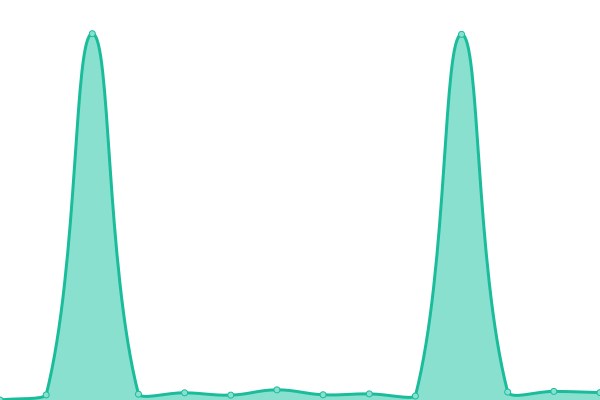

# [📈 Live Status](https://status.adadapted.dev): <!--live status--> **🟧 Partial outage**

This repository contains the uptime monitor and [status page](https://status.adadapted.dev) for AdAdapted APIs, powered by [Upptime](https://github.com/upptime/upptime).

With [Upptime](https://upptime.js.org), you can get your own unlimited and free uptime monitor and status page, powered entirely by a GitHub repository. We use [Issues](https://github.com/adadaptedinc/upptime/issues) as incident reports, [Actions](https://github.com/adadaptedinc/upptime/actions) as uptime monitors, and [Pages](https://status.adadapted.dev) for the status page.

<!--start: status pages-->
<!-- This summary is generated by Upptime (https://github.com/upptime/upptime) -->
<!-- Do not edit this manually, your changes will be overwritten -->
<!-- prettier-ignore -->
| URL | Status | History | Response Time | Uptime |
| --- | ------ | ------- | ------------- | ------ |
|  Telemetry API | 🟥 Down | [telemetry-api.yml](https://github.com/adadaptedinc/upptime/commits/HEAD/history/telemetry-api.yml) | 

 0ms
     
 | 

<a href="https://status.adadapted.dev/history/telemetry-api">0.79%</a>
    

|  MSP API | 🟩 Up | [msp-api.yml](https://github.com/adadaptedinc/upptime/commits/HEAD/history/msp-api.yml) | 

 0ms
     
 | 

<a href="https://status.adadapted.dev/history/msp-api">100.00%</a>
    

|  Ad Service API | 🟩 Up | [ad-service-api.yml](https://github.com/adadaptedinc/upptime/commits/HEAD/history/ad-service-api.yml) | 

 0ms
     
 | 

<a href="https://status.adadapted.dev/history/ad-service-api">100.00%</a>
    

|  PaaS Management API | 🟩 Up | [paas-management-api.yml](https://github.com/adadaptedinc/upptime/commits/HEAD/history/paas-management-api.yml) | 

 0ms
     
 | 

<a href="https://status.adadapted.dev/history/paas-management-api">100.00%</a>
    

|  PaaS Admin API | 🟩 Up | [paas-admin-api.yml](https://github.com/adadaptedinc/upptime/commits/HEAD/history/paas-admin-api.yml) | 

 0ms
     
 | 

<a href="https://status.adadapted.dev/history/paas-admin-api">9.04%</a>
    

|  PaaS Service API | 🟩 Up | [paas-service-api.yml](https://github.com/adadaptedinc/upptime/commits/HEAD/history/paas-service-api.yml) | 

 0ms
     
 | 

<a href="https://status.adadapted.dev/history/paas-service-api">100.00%</a>
    

<!--end: status pages-->

[**Visit our status website →**](https://status.adadapted.dev)

## 📄 License

- Code: [MIT](./LICENSE) © [Upptime](https://upptime.js.org)
- Data in the `./history` directory: [Open Database License](https://opendatacommons.org/licenses/odbl/1-0/)
