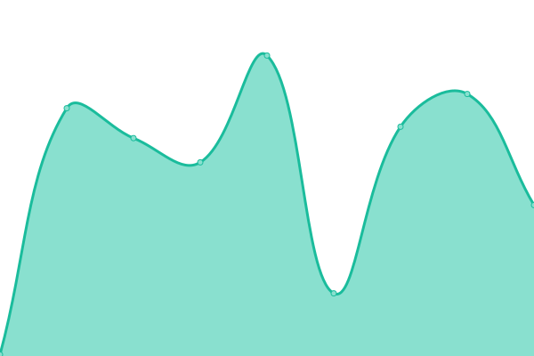
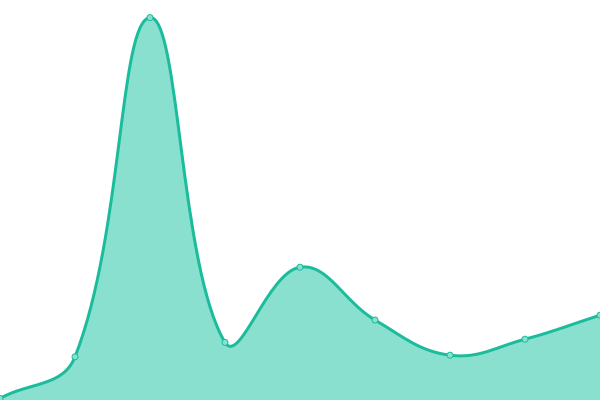
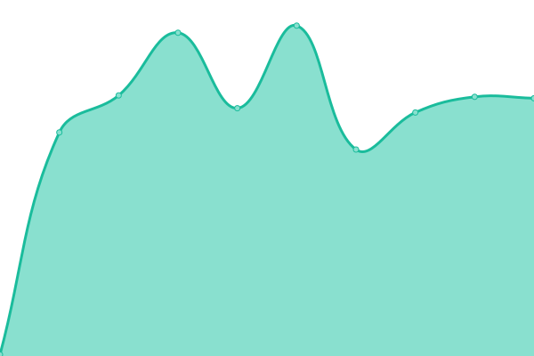

# [📈 Live Status](https://demo.upptime.js.org): <!--live status--> **🟩 All systems operational**

This repository contains the open-source uptime monitor and status page for [Upptime](https://upptime.js.org), powered by [Upptime](https://github.com/upptime/upptime).

With [Upptime](https://upptime.js.org), you can get your own unlimited and free uptime monitor and status page, powered entirely by a GitHub repository. We use [Issues](https://github.com/upptime/upptime/issues) as incident reports, [Actions](https://github.com/upptime/upptime/actions) as uptime monitors, and [Pages](https://demo.upptime.js.org) for the status page.

<!--start: status pages-->
<!-- This summary is generated by Upptime (https://github.com/upptime/upptime) -->
<!-- Do not edit this manually, your changes will be overwritten -->

| URL                                                        | Status | History                                                                                                                                   | Response Time                                                                                        | Uptime                                                                                                                                                                                                                                                        |
| ---------------------------------------------------------- | ------ | ----------------------------------------------------------------------------------------------------------------------------------------- | ---------------------------------------------------------------------------------------------------- | ------------------------------------------------------------------------------------------------------------------------------------------------------------------------------------------------------------------------------------------------------------- |
| [AdAdapted Direct](https://direct.dev.adadapted.dev)       | 🟩 Up  | [ad-adapted-direct.yml](https://github.com/adadaptedinc/upptime/commits/master/history/ad-adapted-direct.yml)                             |  260ms               |                             |
| [AdAdapted Circulars](https://circulars.dev.adadapted.dev) | 🟩 Up  | [ad-adapted-circulars.yml](https://github.com/adadaptedinc/upptime/commits/master/history/ad-adapted-circulars.yml)                       |  208ms            |                       |
| AdAdapted Direct Reporting API                             | 🟩 Up  | [ad-adapted-direct-reporting-api.yml](https://github.com/adadaptedinc/upptime/commits/master/history/ad-adapted-direct-reporting-api.yml) |  176ms |  |
| AdAdapted Direct Service API                               | 🟩 Up  | [ad-adapted-direct-service-api.yml](https://github.com/adadaptedinc/upptime/commits/master/history/ad-adapted-direct-service-api.yml)     |  35ms    |     |
| Circular API                                               | 🟩 Up  | [circular-api.yml](https://github.com/adadaptedinc/upptime/commits/master/history/circular-api.yml)                                       |  1539ms                   |                                        |
| Telemetry API                                              | 🟩 Up  | [telemetry-api.yml](https://github.com/adadaptedinc/upptime/commits/master/history/telemetry-api.yml)                                     |  172ms                   |                                      |

<!--end: status pages-->

[**Visit our status website →**](https://demo.upptime.js.org)

## 📄 License

- Code: [MIT](./LICENSE) © [Upptime](https://upptime.js.org)
- Data in the `./history` directory: [Open Database License](https://opendatacommons.org/licenses/odbl/1-0/)
